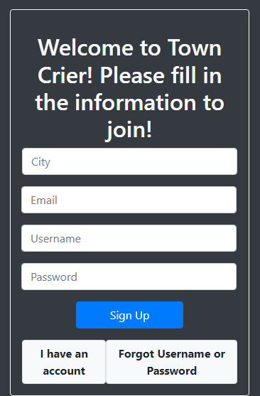
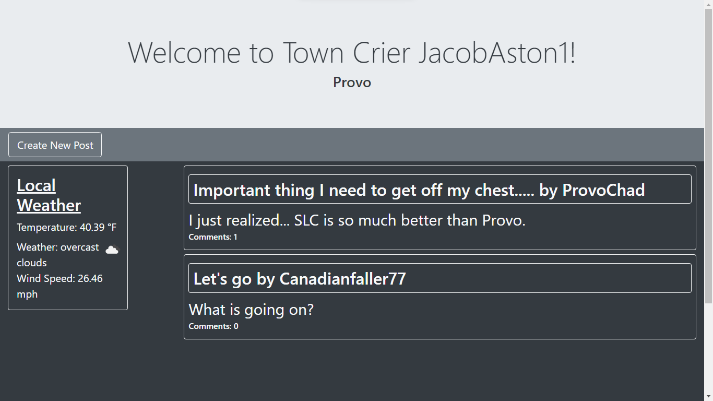

# Town Crier   

## Description

Town Crier is a localized chat app where people are put into chatrooms with people from their city. You can post on your town page or you can open someones post to read or make a comment. This app features a session cookie for login authorization. Bootstrap for css. Socket.io as a back end technology to show when users connect. And a database for post and user data.

## Table of Contents

- [Installation](#installation)
- [Usage](#usage)
- [Contributing](#contributing)
- [License](#license)

## Installation

You can find our live page at: https://town-crier-app.herokuapp.com/.

Town Crier repo: https://github.com/lbako801/Town-Crier.

To create your own local server using express and mysql. Put your database info into the ``````.env file. Then open a terminal on ```server.js``` and run an ```npm i``` command. Enter ```mysql -u root -p``` in your terminal to open your mysql shell. Then run ```SOURCE db/schema.sql;```. This sets up the database. You can use ```exit;``` to leave to mysql shell. Exit the shell and run ```node seeds/index.js``` in your terminal to seed your database. Finally enter ```npm start``` into your terminal to start the server. Open your browser and go to ```"localhost:3000/login"``` to find the login page in order to access the app.

## Usage

You can visit the page live at https://town-crier-app.herokuapp.com/. 

Login or click Join Town Crier and sign up to get a town page.




Click "Create New Post" to add a post to your town page.
Or click on a post to open the post and see the comments.



 
Click the create new comment button to add a comment to the post.
To get back to the town page use your browsers back arrow until the town page comes back. You will be logged out automatically after 24 hours.
  


## License

MIT License

Copyright (c) 2023 Loren Bako

Permission is hereby granted, free of charge, to any person obtaining a copy
of this software and associated documentation files (the "Software"), to deal
in the Software without restriction, including without limitation the rights
to use, copy, modify, merge, publish, distribute, sublicense, and/or sell
copies of the Software, and to permit persons to whom the Software is
furnished to do so, subject to the following conditions:

The above copyright notice and this permission notice shall be included in all
copies or substantial portions of the Software.

THE SOFTWARE IS PROVIDED "AS IS", WITHOUT WARRANTY OF ANY KIND, EXPRESS OR
IMPLIED, INCLUDING BUT NOT LIMITED TO THE WARRANTIES OF MERCHANTABILITY,
FITNESS FOR A PARTICULAR PURPOSE AND NONINFRINGEMENT. IN NO EVENT SHALL THE
AUTHORS OR COPYRIGHT HOLDERS BE LIABLE FOR ANY CLAIM, DAMAGES OR OTHER
LIABILITY, WHETHER IN AN ACTION OF CONTRACT, TORT OR OTHERWISE, ARISING FROM,
OUT OF OR IN CONNECTION WITH THE SOFTWARE OR THE USE OR OTHER DEALINGS IN THE
SOFTWARE.

## Contributing

This is a node application using bcrypt for password hashing, dotenv for private data handling, eslint for code standardization, express for a local server, express-handlebars for our html views, express-session for our login cookie, moment for a timestamp, mysql and mysql2 for our database, sequelize for handling our data, and socket.io for backend notifications. You can find these modules at npmjs.com.

## Questions

If you have any questions you can find our team on github.

 - [Loren Bako](https://github.com/lbako801)
 - [Matthew Gaskins](https://github.com/mgaskins17)
 - [Ethan Sorenson](https://github.com/EfSoren)
 - [Jacob Aston](https://github.com/Jacob-Aston)

---
